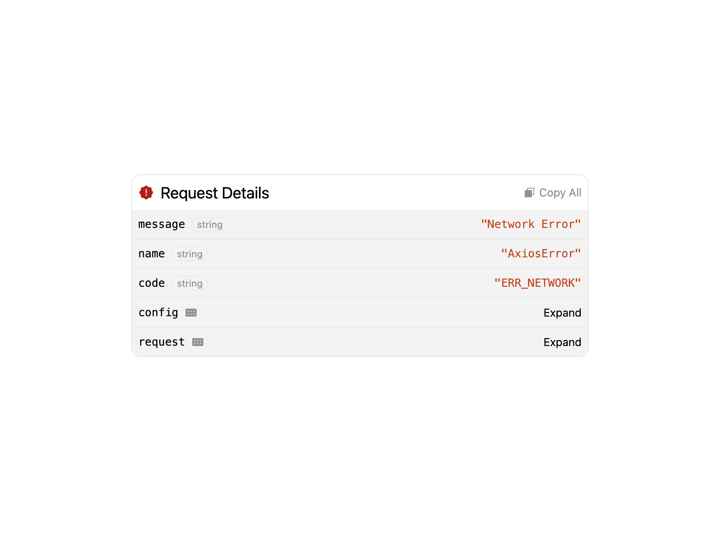
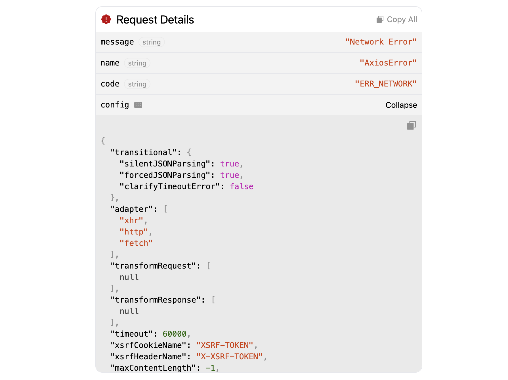

# 🛡️ React Error Reporting

A React component that listens to custom events and displays detailed Axios error stack information in a beautiful UI.




---

## Features

- 📦 Displays Axios/fetch error stack
- 🧠 Smart "Copy All" functionality
- 🌍 i18n-ready with `translateKeys` override
- 🎨 Pluggable empty UI state
- 🧰 Works with any `EventTarget` (custom, DOM, window)

---

## Installation

```bash 
npm install react-error-reporting
```

## Basic Usage
### Import the component and use it:

```tsx
import { ReactErrorReporting } from "react-error-reporting";

<ReactErrorReporting
  eventKey="REQ_ERR"
  eventTarget={EVENT_TARGET}
/>
```


## Dispatch the event from your Axios interceptor:

```tsx
axios.interceptors.response.use(
  res => res,
  err => {
    const errorEvent = new CustomEvent("REQ_ERR", { detail: err });
    EVENT_TARGET.dispatchEvent(errorEvent);
    return Promise.reject(err);
  }
); 
```

## Props

| Props        | Type           |  Required  | Description |
| ------------- |-------------| :------:   | ---------- |
| eventKey      | string        |   ✅       | The event name to listen for |
| eventTarget   | EventTarget   |   ✅       | The source to attach the listener to |
| translateKeys | object        |    ❌      | Override labels for copy, expand, etc. (see below) |
| emptyComponent | React.ReactNode | ❌ | Custom component to render when there's no error |
| onCopy | () => void | ❌ | Callback triggered when "Copy All" is clicked |

## i18n Translation Keys
### You can customize labels like this:

```tsx
<ReactErrorReporting
  eventKey="REQ_ERR"
  eventTarget={window}
  translateKeys={{
    copyAll: "Copy",
    requestDetails: "Error Info",
    collapse: "Hide",
    expand: "Show"
  }}
/>
```

License MIT © Abdullah Khan

Author Built by Abdullah Khan — PRs & contributions welcome!